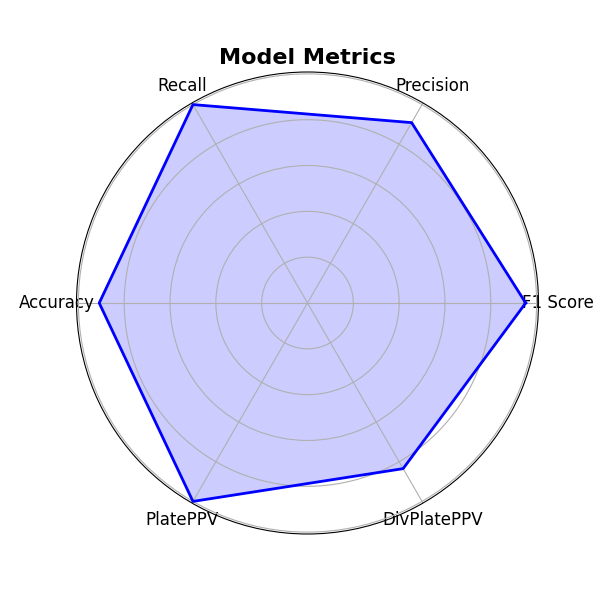

# AIRCHECK ML Pipeline

## Overview

The AIRCHECK ML Pipeline is a modular machine learning pipeline for model training, evaluation, screening, and model selection. It supports multiple machine learning models, automatic hyperparameter tuning, model fusion, and virtual screening with chemical filters and clustering.

## Project Structure

```
aircheck_ml_pipeline/
├── aircheck_pipeline.py                  # Main script to run the entire pipeline
├── config.yaml                           # Configuration file with all pipeline settings
│
├── data_utils.py                         # Functions for data loading, processing, and balancing
├── model_utils.py                        # Functions for model training, initialization, and tuning
├── eval_utils.py                         # Functions for model evaluation and metric calculation
├── fusion_utils.py                       # Functions for model selection, fusion, and radar plot generation
├── config_utils.py                       # Utilities for reading, validating, and writing the configuration file
├── screening_utils.py                    # Functions for screening: fingerprinting, chemistry filtering, and clustering
│
├── Results/                              # Directory where results, models, and radar plots are saved
│   ├── BestModels/                       # Best models selected for fusion
│   ├── BestModels.txt                    # List of best models' paths
│   ├── FusionResults.csv                 # Fusion results across top models
│   ├── RadarChart_TopModels.png         # Radar chart visualizing top model performance
│   └── results.csv                       # Model training and test metrics
```

## Key Features

* Supports multiple ML models (Random Forest, Logistic Regression, SVM, Gradient Boosting, etc.)
* Automatic model selection using Bayesian optimization (optional)
* Cross-validation and final model training
* Automated model selection and score fusion
* Detailed model evaluation with radar plots
* Virtual screening including fingerprint extraction, chemical filtering, and clustering
* Configurable through a single YAML configuration file

## How to Use

### 1. Configure Your Settings

Edit the `config.yaml` file to specify your settings.

### 2. Run the Pipeline

```bash
python aircheck_pipeline.py
```

### 3. Check the Results

* Results are saved in the `Results` directory.
* Includes:
  * Model folders with saved models.
  * A `results.csv` file with training and evaluation metrics.
  * A radar plot image (`RadarChart_TopModels.png`) showing the performance of top models.
  * Virtual screening outputs in CSV format.

<p align="center">

</p>

## Configuration Options

The pipeline behavior is controlled by the `config.yaml` file. Here's an overview:

### General Options
- `protein_name`: Name of the protein target
- `Train`: 'Y' or 'N' to enable/disable training
- `Test`: 'Y' or 'N' to enable/disable testing
- `Screen`: 'Y' or 'N' to enable/disable virtual screening

### Data
- `train_data`, `test_data`: Lists of parquet files for training/testing
- `desired_columns`: List of fingerprint columns (e.g., `[ECFP4, ECFP6]`)
- `label_column_train`, `label_column_test`: Label columns for training/testing
- `nrows_train`, `nrows_test`: Optional limit for number of rows
- `feature_fusion_method`: 'None', 'All', or 'Pairwise'

### Balanced Datasets
- `balance_flag`: `True` or `False`
- `balance_ratios`: List of class ratios

### Screening
- `screen_data`: List of CSV files for screening
- `smiles_column`: Column containing SMILES strings
- `chemistry_filters`: 'Y' or 'N' to enable chemical filtering

### Models
- `desired_models`: List of model codes (e.g., `[rf, lr, svc]`)
- `hyperparameters_tuning`: 'Y' or 'N'
- `hyperparameters`: Dictionary of model hyperparameters
- `Nfold`: Number of cross-validation folds

### Conformal Prediction
- `conformal_prediction`: 'Y' or 'N'
- `confromal_test_size`: Fraction of data for calibration
- `confromal_confidence_level`: Confidence level (e.g., 0.95)

### Model Selection
- `trainfile_for_modelselection`, `evaluationfile_for_modelselection`: Custom files for selection
- `evaluation_column`, `crossvalidation_column`: Metrics used for selection

### Model Fusion
- `Fusion`: 'Y' or 'N'
- `num_top_models`: Number of top models to fuse

## Virtual Screening

When `Screen: 'Y'` is set in the config, the pipeline will:
1. Compute fingerprints for the screen data
2. Apply drug-likeness filters (Lipinski, Ghose, Veber)
3. Predict probabilities using top models
4. Use conformal prediction if enabled
5. Cluster molecules using RDKit fingerprint similarity
6. Output the top candidate per cluster

The final clustered screening results are saved in the `Results` directory with `_Clustered.csv` suffix.

---

For detailed documentation of each step, please check the comments and docstrings in the respective Python files.
