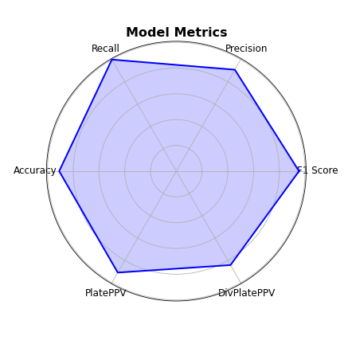

# AIRCHECK ML Pipeline

## Overview

The AIRCHECK ML Pipeline is a modular machine learning pipeline for model training, evaluation, screening, model selection, and model fusion on imbalanced fingerprint datasets. This version adds cluster-held-out cross-validation, per-fold + mean CV prediction artifacts, p-value/enrichment curves, weighted fusion, regression-model support, optional Optuna HPO, optional process-level parallelism, and a resilience layer that records per-combo / per-fold failures without taking down the run.

## Project Structure (code)

```
aircheck_ml_pipeline/
├── aircheck_pipeline.py                  # Main entry point — orchestrates every step
├── config.yaml                           # All pipeline settings
│
├── data_utils.py                         # Data loading, fingerprint parsing, balanced-set creation, feature fusion
├── model_utils.py                        # get_model / train_model, CV folds, CV training, final fit, parallel dispatcher
├── eval_utils.py                         # evaluate_model, calculate_metrics (incl. AreaHitsAtK, NDCG, BEDROC, RMSE/MAE/R2),
│                                         #   test pipeline, hit-curve / p-value / enrichment / CV-curve plots
├── fusion_utils.py                       # select_best_models, weighted-fusion meta-learner, mean/max/weighted fusion,
│                                         #   radar plots (standard + Precision@K), fusion hit curves
├── hpo_utils.py                          # Optuna TPE search using the saved CV folds
├── nn_models.py                          # TensorFlow/Keras model constructors (tf_ff, tf_cnn1D)
├── config_utils.py                       # Read/validate/write config; results.csv writer
├── screening_utils.py                    # Virtual screening: fingerprinting, drug-likeness filters, clustering
├── log_results.py                        # MLflow logging
└── plot_results.py                       # Optional auxiliary plots
```

## Run-folder Structure (`{RunFolderName}/`)

`{RunFolderName}` defaults to the value of `run_name` in `config.yaml` (e.g. `ProteinX/`). Every artifact below is produced automatically; sub-folders that depend on optional features are noted.

```
{RunFolderName}/
├── config.yaml                                              # Snapshot of the config used for this run
├── results.csv                                              # One row per (train, model, column) — CV_* and Test_* metrics
├── results_selectedcolumns.csv                              # Compact summary: TrainFileName, TestFile, ColumnName,
│                                                            #   ModelType, Test_HitsAt50/100/200/500
├── training_failures.csv                                    # Per-failure log (created only if any combo or fold failed):
│                                                            #   ModelType, ColumnName, Stage, ErrorType, ErrorMessage, TracebackTail
├── BestModels.txt                                           # Plain list of selected best-model paths
├── SortedUniqueResults.csv                                  # Full results sorted by the selection criterion
│
├── CVFolds/                                                 # CV split definition + UMAP visual checks
│   ├── cv_splits.pkl                                        # List of (train_idx, test_idx) tuples
│   ├── fold_summary.csv                                     # Per-fold #train/#test/#pos/#neg
│   ├── fold_{N}_train_idx.csv                               # Train indices for fold N
│   ├── fold_{N}_test_idx.csv                                # Test indices for fold N
│   ├── positive_cluster_sizes.csv                           # (cv_method='cluster') Sizes of agglomerative clusters
│   ├── positive_cluster_labels.csv                          # (cv_method='cluster') Cluster id per positive
│   ├── positive_test_group_summary.csv                      # (cv_method='cluster') Per-fold cluster description
│   ├── umap_fold_{N}.png                                    # UMAP (Jaccard) of train pos vs test pos for fold N
│   └── umap_positive_clusters.png                           # (cv_method='cluster') UMAP coloured by cluster id
│
├── HPO/                                                     # (hyperparameters_tuning='optuna' only)
│   └── {model}_{column}.db                                  # SQLite Optuna study per (model, column)
│
├── {train_filename}_{model}_{column}/                       # Per-combo artifacts (one folder per row of results.csv)
│   ├── model.pkl or model.h5                                # Final model trained on the full training set
│   └── model_fold{N}.pkl or .h5                             # Per-fold CV model
│
├── CVResults/                                               # CV-time predictions + plots (matches Test naming)
│   ├── {train}_{model}_{col}_fold{N}_predictions.parquet
│   ├── {train}_{model}_{col}_fold{N}_predictions_sorted.parquet      # Sorted by y_prob desc
│   ├── {train}_{model}_{col}_mean_predictions.parquet                # Mean y_prob across folds (per sample)
│   ├── {train}_{model}_{col}_mean_predictions_sorted.parquet
│   └── {train}_{model}_{col}_cv_hit_curve.png                        # Overlay: each fold + mean curve, capped at top-500
│
├── Predictions/                                             # Test-time predictions + per-model plots
│   ├── {test}_{train}_{model}_{col}_predictions.parquet
│   ├── {test}_{train}_{model}_{col}_predictions_sorted.parquet
│   ├── {test}_{train}_{model}_{col}_predictions_sorted_hit_curve.png        # Cumulative hits vs random baseline
│   ├── {test}_{train}_{model}_{col}_predictions_sorted_pvalue_curve.png     # Hypergeometric -log10(p) vs top-n
│   ├── {test}_{train}_{model}_{col}_predictions_sorted_enrichment_curve.png # (k/n)/(K/N) vs top-n
│   └── {test}_best_models_hit_curve.png                                     # Overlay of selected best models on this test file
│
├── BestModels/                                              # Selected top models (post model-selection)
│   ├── BestModelsResults.csv                                # Subset of results.csv for the chosen models
│   ├── {train}_{model}_{col}_model.pkl or .h5               # Copies of selected best models
│   ├── fusion_weights.pkl                                   # (fusion_method includes 'weighted') Logistic-regression meta-learner
│   ├── fusion_weights.csv                                   # model_col → coefficient (+ intercept)
│   ├── fusion_weights_summary.csv                           # Chosen CV fold, train rows/positives, per-fold scores, regularization
│   └── {test}_best_models_hit_curve.png                     # (also written under Predictions/, see above)
│
├── RadarPlots/                                              # Radar charts comparing the top models
│   ├── RadarChart_TopModels_CV.png                          # F1, Precision, Recall, Accuracy, PlatePPV, balanced_accuracy (CV)
│   ├── RadarChart_TopModels_Test.png                        # Same metrics on the test set
│   ├── RadarChart_TopModels_CV_PrecisionAtK.png             # Precision@10/50/100/200/500 (CV)
│   └── RadarChart_TopModels_Test_PrecisionAtK.png           # Precision@10/50/100/200/500 (test)
│
└── Fusion/                                                  # (Fusion='Y') Fusion outputs — one set per fusion method × test file
    ├── fusion.csv                                           # Metrics for every method (mean_*, max_*, weighted_*)
    ├── fusion_mean_{test}.parquet
    ├── fusion_mean_sorted_{test}.parquet
    ├── fusion_max_{test}.parquet
    ├── fusion_max_sorted_{test}.parquet
    ├── fusion_weighted_{test}.parquet                       # Only when 'weighted' is in fusion_method
    ├── fusion_weighted_sorted_{test}.parquet
    └── {test}_fusion_hit_curve.png                          # Overlay of all enabled fusion curves vs random baseline
```

## Key Features

- **Multiple ML models** — classifiers (`rf`, `lr`, `sgd`, `svc`, `nb`, `dt`, `knn`, `gb`, `ada`, `bag`, `mlp`, `lgbm`, `catboost`, `tf_ff`, `tf_cnn1D`) and regressors (`lgbmregressor`, `rfregressor`, `xgbregressor`, `catboostregressor`, `ridge`).
- **Cross-validation** — `stratified` (StratifiedKFold) or `cluster` (Tanimoto + Agglomerative cluster-held-out folds, ~100 positives + sampled negatives per fold, up to 10 folds with UMAP visual checks).
- **Hyperparameter tuning** — `'none'` (use config-default values), `'bayesian'` (scikit-optimize), or `'optuna'` (Optuna TPE on the saved CV folds, with persistent SQLite studies under `HPO/`).
- **Resilience** — per-(model, column) and per-fold `try/except`; failures are written to `training_failures.csv` instead of taking down the run. A single-class pre-flight check skips degenerate train sets cleanly. Metrics that are `None` for a given fold (e.g. `RMSE` on a classifier, `AUC-ROC` on a single-class fold) are filtered when averaging across folds.
- **CV prediction artifacts** — per-fold and mean-across-folds parquets in `CVResults/`, plus a CV hit-curve plot (per-fold + mean overlay, capped at top-500).
- **Test prediction artifacts** — per-test-file predictions in `Predictions/`, plus three plots per file:
  - `*_hit_curve.png` — model curve vs theoretical random baseline + simulated random fan.
  - `*_pvalue_curve.png` — hypergeometric `-log10(p)` vs top-n, with a `p=0.05` reference line.
  - `*_enrichment_curve.png` — `(k/n) / (K/N)` vs top-n, with a `=1` reference line.

  **How those two are computed** (let `N` = total molecules in the test set, `K` = total positives in the test set, `n` = top-n cutoff being plotted on the x-axis, `k` = positives observed within the top n):
  - **Enrichment(n) = (k/n) / (K/N)** — fold improvement over random ranking; `=1` is no enrichment.
  - **p-value(n) = `hypergeom.sf(k - 1, N, K, n)`** — probability of seeing `k` or more hits in the top `n` by chance, plotted as `-log10(p)` so larger = more significant.
- **Model selection** — top-K by either CV (`modelselection_basis: 'cv'`) or test (`'test'`) ranking columns; selected models copied into `BestModels/` and overlaid on a per-test-file plot.
- **Radar plots** — separate CV and Test radar plots for both standard metrics and Precision@K (10, 50, 100, 200, 500), saved into `RadarPlots/`.
- **Model fusion** — any subset of `['mean', 'max', 'weighted']`. Weighted fusion trains a logistic-regression meta-learner on the single CV fold with the highest mean Hit@200 across the best models (joining per-model fold predictions on `SMILES`); weights persist to `BestModels/fusion_weights.{pkl,csv,_summary.csv}`.
- **Regression models** — drop-in alongside classifiers. Regressors are trained on `regression_column_train`, ranked against `label_column_train` (the binary LABEL) for ranking metrics, and binarized via `regression_threshold` (`'median'` or a float) for threshold-based metrics. RMSE / MAE / R² are added on top.
- **Optional process-level parallelism** — `parallel_train: 'Y'` dispatches `(model, column)` combos to a `ProcessPoolExecutor`. Auto-budgeting (`parallel_workers: 'auto'` and `optuna_n_jobs: 'auto'`) splits cores 50% pool / 25% Optuna / 25% reserved, never oversubscribing. TF models always run serially (single-GPU contention). `parallel_train: 'N'` (default) keeps the original serial behavior.
- **MLflow logging** — optional, controlled inside `aircheck_pipeline.run_pipeline`.

## How to Use

### 1. Configure your settings

Edit `config.yaml`. Key blocks: data paths, `desired_columns`, `desired_models`, `cv_method`, `Nfold`, `hyperparameters_tuning`, `Fusion` / `fusion_method`, and (if running on a multi-core machine) the parallel block.

### 2. Run the pipeline

```bash
python aircheck_pipeline.py
```

### 3. Inspect the results

Outputs are written under `{run_name}/`. The files most users open first:

- `results.csv` and `results_selectedcolumns.csv` — overall metrics.
- `Predictions/*_hit_curve.png`, `*_pvalue_curve.png`, `*_enrichment_curve.png` — test-set behaviour per model.
- `CVResults/*_cv_hit_curve.png` — CV behaviour per model.
- `RadarPlots/*.png` — top-model comparisons.
- `Fusion/fusion.csv` and `Fusion/*_hit_curve.png` — fusion behaviour.
- `training_failures.csv` — only present when something failed; check it before debugging anything else.

<p align="center">

</p>

### 4. View MLflow logs (optional)

```bash
mlflow ui
```

Then open `http://localhost:5000`.

## Configuration Options

The pipeline behaviour is controlled by `config.yaml`. Selected blocks:

### General

- `run_name` — folder name where all run artifacts go.
- `Train` / `Test` / `Screen` / `Fusion` — `'Y'` / `'N'` flags for each phase.

### Data

- `train_data`, `test_data` — list of parquet paths.
- `desired_columns` — list of fingerprint columns (e.g. `[ECFP4, FCFP4]`).
- `label_column_train`, `label_column_test` — binary LABEL columns.
- `regression_column_train`, `regression_column_test` — continuous targets for regressor models (required if `desired_models` contains a regressor; ignored otherwise).
- `regression_threshold` — `'median'` or a float; used to binarize regressor scores for threshold-based metrics.
- `nrows_train`, `nrows_test` — `'None'` or an integer cap.
- `feature_fusion_method` — `'None'`, `'All'`, `'Pairwise'`, or any combined list.

### Balanced datasets

- `balance_flag`, `balance_ratios`.

### Models

- `desired_models` — list of model codes (see the comment block in `config.yaml` for the full list).
- `hyperparameters_tuning` — `'none'`, `'bayesian'`, or `'optuna'`.
- `hyperparameters` — dict of per-model defaults used when tuning is `'none'`.
- `optuna_n_trials`, `optuna_metric`, `optuna_K`, `optuna_n_jobs` — Optuna knobs (`optuna_n_jobs` accepts `'auto'`).

### Cross-validation

- `cv_method` — `'stratified'` or `'cluster'`.
- `Nfold` — number of folds (stratified mode only).
- `cluster_fold_train_neg_ratio` — `'None'` or an integer (per-fold negative downsampling for cluster mode).

### Conformal prediction

- `conformal_prediction`, `confromal_test_size`, `confromal_confidence_level`.

### Model selection

- `trainfile_for_modelselection`, `evaluationfile_for_modelselection` — optional filters.
- `modelselection_basis` — `'cv'` or `'test'`.
- `evaluation_column`, `crossvalidation_column` — sort priority.
- `cv_radar_threshold`, `test_radar_threshold` — probability cutoffs used to recompute radar metrics.

### Model fusion

- `Fusion` — `'Y'` / `'N'`.
- `num_top_models` — number of top models to fuse.
- `fusion_method` — any subset of `['mean', 'max', 'weighted']`.
- `fusion_weighted_C` — L2 strength of the weighted-fusion meta-learner.

### Parallel training

- `parallel_train` — `'N'` (default) or `'Y'`.
- `parallel_workers` — int or `'auto'` (`auto = max(1, cpu_count // 2)`).
- `parallel_skip_tf` — keep TF models serial regardless of pool state.
- `parallel_pin_threads` — force `OMP/MKL/OPENBLAS = 1` inside each worker to avoid thread oversubscription.

When `parallel_train: 'Y'`, `parallel_workers` and `optuna_n_jobs` together respect the budget formula:

```
budget = cpu_count - max(2, cpu_count // 8)     # ~12.5 % reserved for OS / I/O
parallel_workers (auto) = max(1, cpu_count // 2)
optuna_n_jobs    (auto) = max(1, budget // parallel_workers)
```

## Virtual Screening

When `Screen: 'Y'` is set, the pipeline:

1. Computes fingerprints for `screen_data`.
2. Applies drug-likeness filters (Lipinski / Ghose / Veber).
3. Predicts probabilities using the top models.
4. Optionally runs conformal prediction.
5. Clusters molecules by RDKit fingerprint similarity.
6. Outputs the top candidate per cluster.

Final clustered screening results are saved with the `_Clustered.csv` suffix.

---

For step-level documentation, see the docstrings inside each module (`model_utils.py`, `eval_utils.py`, `fusion_utils.py`, `hpo_utils.py`).
